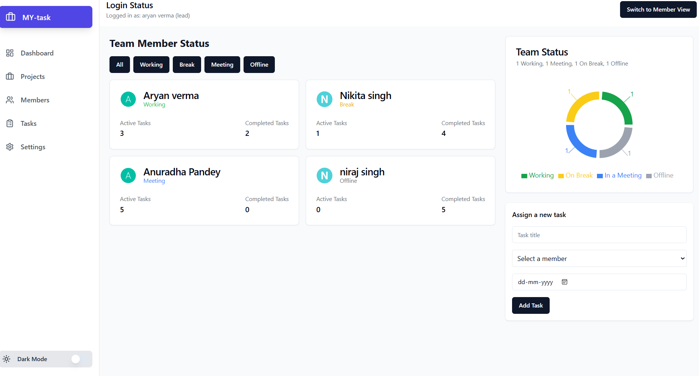
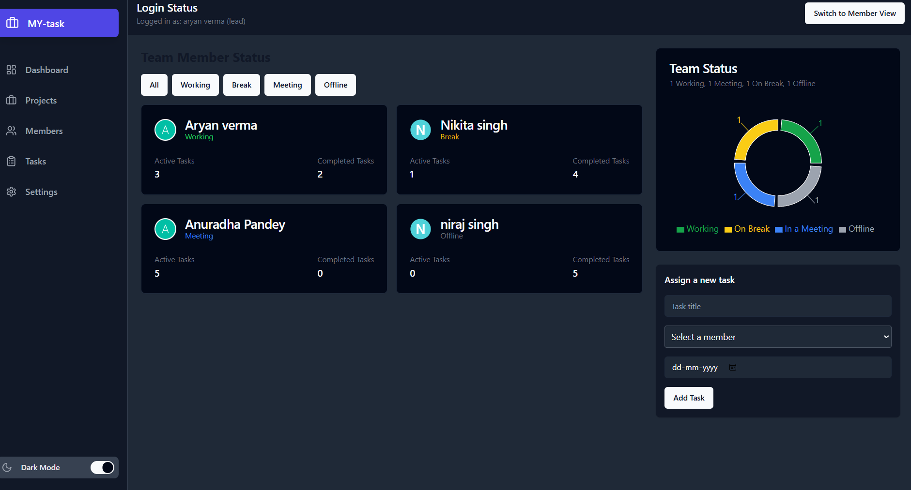
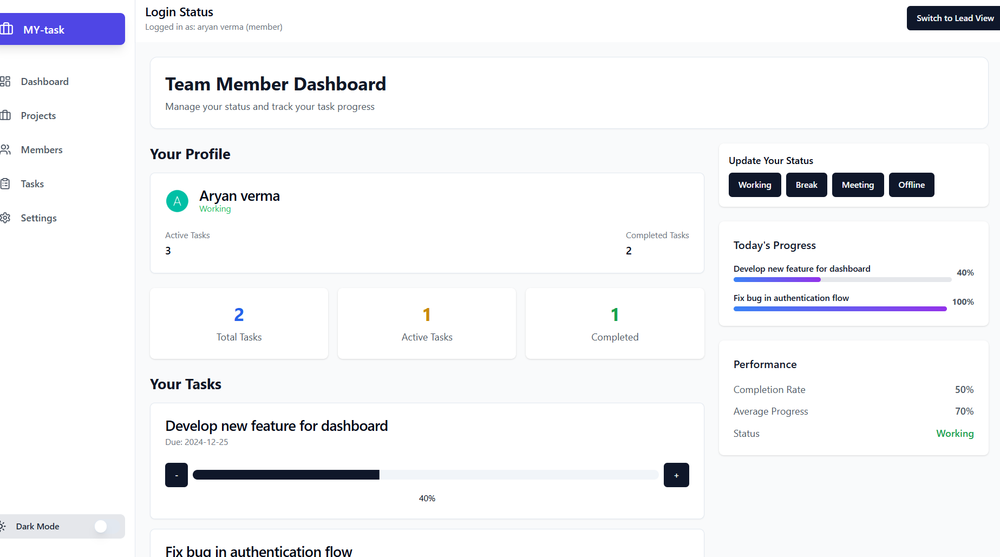
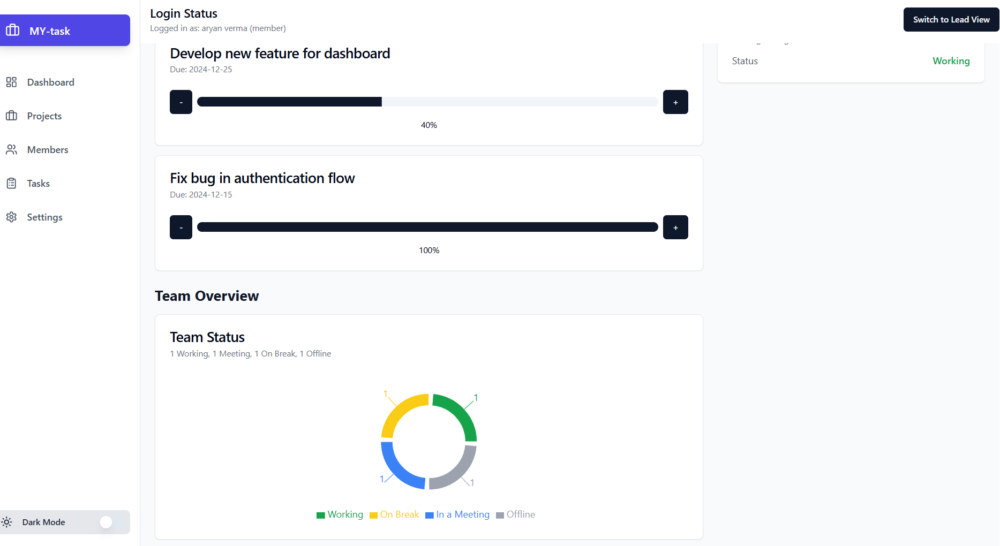

# Team Dashboard

A dynamic and responsive dashboard for teams to manage tasks, track member status, and monitor overall team productivity.  
Built with **React**, **Redux**, and **Tailwind CSS**, this application provides a seamless and intuitive user experience for both team leads and members.

---

## ✨ Features

- **Role-Based Views**: Separate, tailored dashboards for Team Leads and Team Members.  
- **Real-Time Status Tracking**: Team members can update their status (*Working, On Break, In a Meeting, Offline*), visible to the entire team.  
- **Task Management**: Team leads can create and assign tasks, while members can view and update their task progress.  
- **Interactive Charts**: Visual representation of team statistics, such as the distribution of member statuses.  
- **Dark Mode**: Sleek and modern dark mode for comfortable viewing in low-light environments.  
- **Responsive Design**: Fully responsive layout that works across all screen sizes (mobile, tablet, desktop).  

---

## 🛠 Tech Stack

- **Frontend**: React, React Router  
- **State Management**: Redux Toolkit  
- **Styling**: Tailwind CSS, Radix UI  
- **Build Tool**: Vite  
 

---

## 🚀 Getting Started

### ✅ Prerequisites
- Node.js (**v14 or higher**)  
- npm or yarn  

### 📦 Installation

Clone the repository:
```bash
git clone https://github.com/your-username/your-repository-name.git
Navigate to the project directory:

bash
Copy code
cd your-repository-name
Install the dependencies:

bash
Copy code
npm install
▶️ Running the Application
Start the development server:

bash
Copy code
npm run dev
The app will be available at: http://localhost:5173

📂 Project Structure

Copy code
├── public/               # Static assets (images, icons, etc.)
├── src/
│   ├── components/       # Reusable UI components
│   ├── pages/            # Main page components (Dashboards, role views)
│   ├── redux/            # Redux Toolkit slices & store
│   ├── lib/              # Utility functions and libraries
│   └── main.jsx          # Entry point
└── package.json
🔄 State Management
The application uses Redux Toolkit for centralized state management.
The state is organized into the following slices:

membersSlice: Manages team members, their statuses, and filtering options.

tasksSlice: Handles tasks, their progress, and assignments.

roleSlice: Manages the current user's role (Team Lead or Team Member) and enables view switching.

📜 Available Scripts
In the project directory, you can run:

npm run dev → Runs the app in development mode.

npm run build → Builds the app for production.

## 📸 Screenshots

### Dashboard (Light Mode)


### Dashboard (Dark Mode)


### Dashboard (Lead Mode)


### Dashboard (member Mode)
